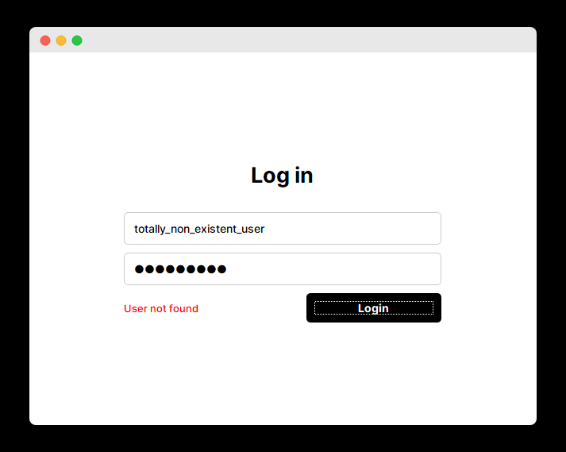
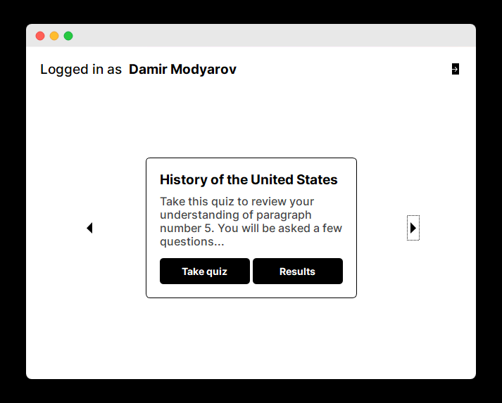
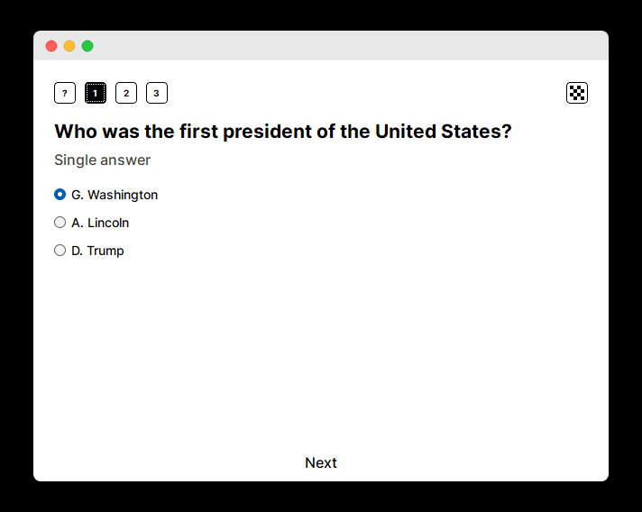

# Пояснительная записка к проекту

## Описание

quizzycat Desktop - это настольное приложения для учеников и учителей,
которое позволяет создавать и проходить тесты, а также просматривать
статистику по их прохождению.

## Автор

Автором проекта является студент Яндекс.Лицея 2022 года, 
[Дамир Модьяров](https://otomir23.me).

## Реализация

Во время разработки был создан простой фреймворк 
страниц приложения, который позволяет использовать страницы
из .ui файлов, а также переходить и передавать данные между ними.

Для дизайна приложения была использована программа Figma.

## Структура проекта

В корне проекта находятся основные скрипты, которые используются по всему
проекту, а также входной файл `main.py`.

В папке `pages` находятся макеты страниц приложения, а также файл
`__init__.py`, который подключает их к приложению.

В папке `forms` находятся файлы с формами, которые используются для
создания пользователей и тестов.

В папке `assets` находятся картинки и шрифты, которые используются в
проекте.

## Используемые технологии

- **Python 3.9** - язык программирования
- **PyQt5** - библиотека для создания графического интерфейса
- **peewee** - ORM для работы с базой данных
- **Figma** - инструмент для создания макетов и иконок
- **Git** - система контроля версий
- **GitHub** - хостинг для размещения проекта
- **SQLite** - база данных
- **PyInstaller** - инструмент для создания исполняемых файлов

## Установка

Скачайте последний выполняемый файл для нужной операционной системы
[здесь](https://github.com/otomir23/quizzycat-desktop/releases).

## Скриншоты

